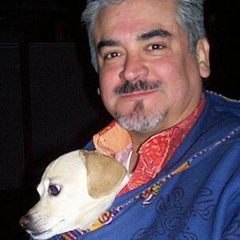

# How to build the demo

- A simple CMake command to build C-API library of PaddlePaddle on linux
  ```
  cmake -DCMAKE_INSTALL_PREFIX=$DEST_ROOT \
        -DCMAKE_BUILD_TYPE=Release \
        -DWITH_C_API=ON \
        -DWITH_PYTHON=OFF \
        -DWITH_MKLML=OFF \
        -DWITH_MKLDNN=OFF \
        -DWITH_GPU=OFF \
        -DWITH_SWIG_PY=OFF \
        -DWITH_GOLANG=OFF \
        -DWITH_STYLE_CHECK=OFF \
        ..
  ```

- Use virtual data as the input
  ```bash
  export PADDLE_ROOT=...
  mkdir build
  cd build
  cmake ..
  make
  ```

- Use real image as the input
  ```bash
  export PADDLE_ROOT=...
  export OPENCV_ROOT=...
  mkdir build
  cd build
  cmake ..
  make
  ```

# Result Profile
- Input

  

- Direct result
  ```text
  Result: 7 x 7
  row 0: 0 5 0.0102905 0.60527 0.749781 0.668338 0.848811
  row 1: 0 12 0.530176 0.0782789 0.640581 0.721344 0.995839
  row 2: 0 12 0.017214 0.0692175 0 1 0.972674
  row 3: 0 15 0.998061 0.091996 0 0.995694 1
  row 4: 0 15 0.0404764 0.835338 0.014217 1 0.44674
  row 5: 0 15 0.0102714 0.718238 0.00674325 0.993035 0.659929
  row 6: 0 18 0.0122269 0.0692175 0 1 0.972674
  ```

- Profiled result
  ```text
  Object 0
      image: 0
      type: bottle
      score: 0.0102905
      rectangle information:
          xmin, 0.60527
          ymin, 0.749781
          xmax, 0.668338
          ymax, 0.848811
  Object 1
      image: 0
      type: dog
      score: 0.530176
      rectangle information:
          xmin, 0.0782789
          ymin, 0.640581
          xmax, 0.721344
          ymax, 0.995839
  Object 2
      image: 0
      type: dog
      score: 0.017214
      rectangle information:
          xmin, 0.0692175
          ymin, 0
          xmax, 1
          ymax, 0.972674
  Object 3
      image: 0
      type: person
      score: 0.998061
      rectangle information:
          xmin, 0.091996
          ymin, 0
          xmax, 0.995694
          ymax, 1
  Object 4
      image: 0
      type: person
      score: 0.0404764
      rectangle information:
          xmin, 0.835338
          ymin, 0.014217
          xmax, 1
          ymax, 0.44674
  Object 5
      image: 0
      type: person
      score: 0.0102714
      rectangle information:
          xmin, 0.718238
          ymin, 0.00674325
          xmax, 0.993035
          ymax, 0.659929
  Object 6
      image: 0
      type: sofa
      score: 0.0122269
      rectangle information:
          xmin, 0.0692175
          ymin, 0
          xmax, 1
          ymax, 0.972674
  ```

- Profiled result (threshold = 0.3)
  ```text
  Object 1
      image: 0
      type: dog
      score: 0.530176
      rectangle information:
          xmin, 0.0782789
          ymin, 0.640581
          xmax, 0.721344
          ymax, 0.995839
  Object 3
      image: 0
      type: person
      score: 0.998061
      rectangle information:
          xmin, 0.091996
          ymin, 0
          xmax, 0.995694
          ymax, 1
  ```
